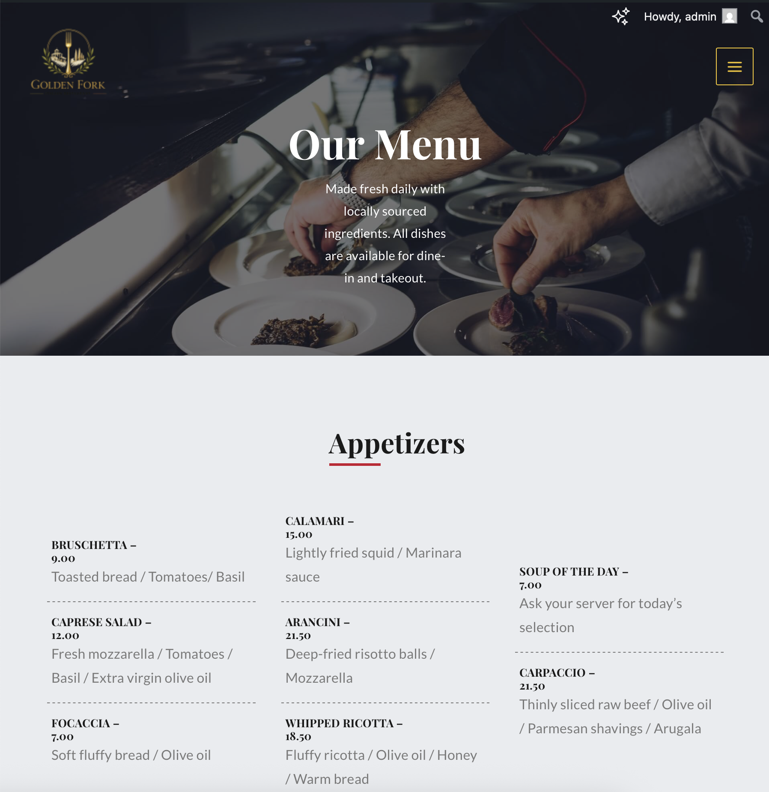
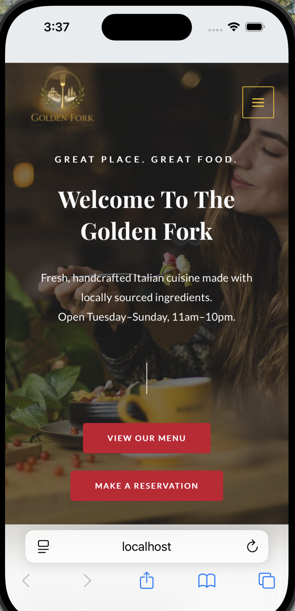

# Golden Fork - Restaurant Website

A full-stack restaurant website built with WordPress on a local LAMP stack environment.

## Tech Stack

- **WordPress** - CMS and content management
- **PHP 8.2** - Server-side templating and hooks
- **MySQL** - Database via phpMyAdmin
- **Apache** - Local web server via XAMPP
- **HTML/CSS** - Custom styling and layouts

## Features

- Custom WordPress child theme with PHP action and filter hooks
- Custom Post Type (Menu Items) with custom taxonomy (Menu Categories)
- Advanced Custom Fields for structured menu data
- Yoast SEO configuration with meta titles and descriptions
- WPForms contact form with custom dropdown field
- W3 Total Cache for performance optimization
- Fully responsive design testing on laptop, tablet, and mobile
- Custom 404 page with redirect logic

## Technical Highlights

### Child Theme Development
Built a WordPress child theme from scratch including:
- Custom style.css with proper theme headers
- functions.php with wp_enqueue_scripts action hook
- Security hardening via the_generator filter hook
- Custom body classes via body_class filter hook

### Custom Post Types
Created structured content architecutre using: 
- CPU UI plugin for post type registration
- Custom menu_item post type with menu_category taxonomy
- Advanced Custom Fields for price field management

### Debugging Experience
- Diagnosed and resolved Apache file permission errors using chmod/chown Terminal commands
- Used WP_DEBUG mode to surface and fix PHP syntax errors
- Simulated and resovled plugin conflict scenarios

## How to Run Locally

1. Install XAMPP and start Apache and MySQL
2. Clone this repository into your wp-content/themes/ directory
3. Import restaurant_db.sql into phpMyAdmin
4. Activate the Astra parent theme then the Astra  Child theme
5. Visit https://localhost/restaurant

## What I Leanred

- WordPress template hierarchy and hook system
- LAMP stack configuration and debugging
- MySQL database management
- PHP customization within WordPress
- Web performance and SEO best practices
- Professional Debugging workflows

## Screenshots

